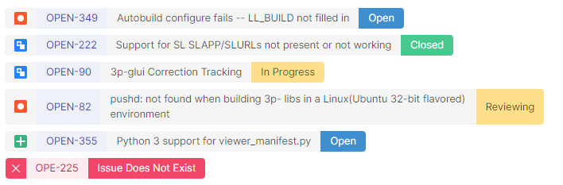

# Obsidian jira-issue

This plugin allows you to track the progress of [Atlassian Jira](https://www.atlassian.com/software/jira) issues from your [Obsidian](https://obsidian.md/) notes.



## Usage

### Configuration

Use the plugin options to configure the connection to your company Atlassian Jira server: host, username and password.

There are three authentication methods:

- Open: used for server without authentication.
- [Basic](https://datatracker.ietf.org/doc/html/rfc7617): username and password are used to login in your server.
- [Bearer](https://datatracker.ietf.org/doc/html/rfc6750): a token is used to login in your server.

This plugin stores your credential in clear in the configuration file of this plugin.

### Markdown syntax

Use the fence syntax to track issues:

    ```jira-issue
    AAA-111
    AAA-222
    https://my.jira-server.com/browse/BBB-333
    # This is a comment
    ```

## Commands

- Insert fence template: insert at the cursor position, the jira-issue fence block.
- Clear cache: clear cached issues before the expiration time to download them again.

## Installation
From the obsidian app go in `Settings > Third-party plugins > Community Plugins > Browse` and search for `jira-issue`.

# TODO

- [ ] Add support for JQL query
- [ ] Add support for inline issues